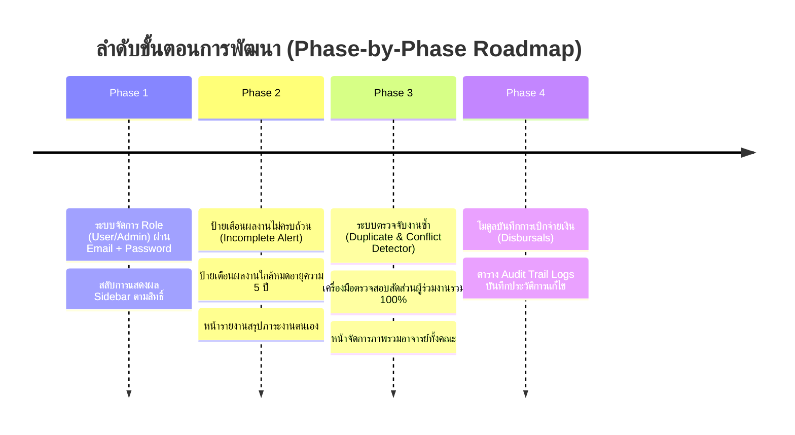

# 📋 แผนงานและสถาปัตยกรรมระบบบริหารจัดการภาระงานและผลงานวิชาการ (System Architecture & Workflow Plan)

## 📌 1. สรุปสถานะการดำเนินงานที่ผ่านมา (Completed Milestones)
- [x] **1. ค้นหาชื่ออาจารย์จากฐานข้อมูลด้วยอีเมลที่ล็อกอิน**:
  - เมื่อเข้าสู่ระบบด้วยอีเมลมหาวิทยาลัย (`@up.ac.th`) ระบบจะเชื่อมโยงกับฐานข้อมูล `users` และ `UP_ICT_FACULTY` ดึงชื่อ-นามสกุล, สังกัดสาขาวิชา, Scholar ID, Scopus ID มาแสดงผลอัตโนมัติ
- [x] **2. แสดงชื่ออาจารย์ผู้ล็อกอินใน "เลือกผลงานจาก Google Scholar"**:
  - ดึงเฉพาะรายการผลงานวิจัยของอาจารย์ผู้ใช้งานปัจจุบันมาแสดงผลใน Modal
- [x] **3. ใส่ชื่ออาจารย์ผู้ล็อกอินในแบบฟอร์มคำนวณอัตโนมัติ**:
  - ฟิลด์ `authorName` ถูกกำหนดค่าเริ่มต้นตามบัญชีอาจารย์ที่เข้าสู่ระบบ
- [x] **4. ยกเลิก Hardcoded Default User**:
  - ผู้ใช้งานต้องล็อกอินผ่านหน้า Login ด้วยบัญชีของตนเอง ไม่มี Fallback อัตโนมัติไปยัง Kittipong

---

## 🏗️ 2. แผนผังบทบาทและสิทธิ์ผู้ใช้งาน (Roles & Permissions Architecture)

ใช้ระบบเข้าสู่ระบบด้วย **Email + Password** ตามปกติที่หน้า Login แล้วระบบจะทำการจำแนกสิทธิ์ตาม `role` ในฐานข้อมูลทันที:

```mermaid
flowchart TD
    Login[หน้าเข้าสู่ระบบ / Login Page\n(กรอก Email @up.ac.th + Password)] --> AuthCheck{ระบบตรวจสอบ Role ใน Database}
    
    AuthCheck -->|role = 'user'| UserPortal[👤 User Portal: โหมดอาจารย์ / ผู้ใช้ทั่วไป]
    AuthCheck -->|role = 'admin'| AdminPortal[🛡️ Admin Console: โหมดผู้ดูแลระบบ]

    subgraph UserCapabilities [สิทธิ์และฟังก์ชันของ User ทั่วไป]
        UserPortal --> U1[📊 ตรวจสอบภาระงาน & คะแนนคุณภาพตนเอง]
        UserPortal --> U2[🎯 เครื่องมือวางแผนคำนวณภาระงาน Simulator]
        UserPortal --> U3[💰 ติดตามสถานะและรอบวันที่เบิกจ่ายเงินรางวัล]
        UserPortal --> U4[⚠️ ระบบแจ้งเตือนข้อมูลไม่ครบถ้วน Incomplete Alert]
        UserPortal --> U5[⏳ ระบบแจ้งเตือนผลงานใกล้หมดอายุความ Expiry Warning 5 ปี]
    end

    subgraph AdminCapabilities [สิทธิ์และฟังก์ชันของ Admin]
        AdminPortal --> A1[👥 ภาพรวมภาระงานของอาจารย์ทั้งคณะ / แยก 8 สาขาวิชา]
        AdminPortal --> A2[✏️ เพิ่ม / แก้ไข / ตรวจสอบผลงานวิชาการของทุกคน]
        AdminPortal --> A3[🔍 ระบบตรวจจับผลงานซ้ำซ้อน Duplicate Detection]
        AdminPortal --> A4[🤝 ตรวจสอบสัดส่วนผู้ร่วมงาน Co-author รวม 100%]
        AdminPortal --> A5[💵 จัดการและบันทึกการเบิกจ่ายเงินรางวัล Disbursal Record]
        AdminPortal --> A6[📜 ตรวจสอบประวัติการแก้ไขข้อมูล Audit Trail Logs]
    end
```

---

## 🔐 3. รูปแบบการเข้าใช้งานของผู้ดูแลระบบ (Admin Email & Password Flow)

เพื่อให้สะดวกและรวดเร็วสำหรับการทดสอบและการใช้งานจริง:
- **หน้า Login รวมหน้าเดียว:** ทั้ง User และ Admin ล็อกอินผ่านหน้าต่างเดียวกันด้วย Email และ Password
- **Auto Role Detection:** Backend ส่ง `role: 'admin'` ใน JWT Token และ User Object
- **Dynamic UI:** 
  - หากเป็น **Admin**: เมนู Sidebar จะแสดงส่วนควบคุมระบบของผู้ดูแล (Admin Menu: จัดการอาจารย์ทุกคน, ตรวจผลงานซ้ำ, บันทึกการเบิกเงิน, ดู Audit Log)
  - หากเป็น **User**: เมนู Sidebar จะแสดงเฉพาะส่วนของตนเอง (Dashboard ส่วนตัว, คำนวณภาระงาน, ผลงานวิจัยของฉัน, ติดตามการเบิกเงิน)

---

## 👤 4. รายละเอียดฟังก์ชันสำหรับผู้ใช้งานทั่วไป (User Portal)

| ฟังก์ชัน | รายละเอียดการทำงาน | หน้าจอ / ส่วนที่เกี่ยวข้อง |
| :--- | :--- | :--- |
| **1. ตรวจสอบคะแนน/ภาระงาน** | สรุปชั่วโมงภาระงานรวม, ชั่วโมงจริงตามสัดส่วน, คะแนนคุณภาพผลงาน, และงบประมาณสนับสนุนที่ได้รับ | หน้า **แดชบอร์ดส่วนบุคคล (My Dashboard)** |
| **2. วางแผนคำนวณผลงาน (Simulator)** | ทดลองเลือกประเภทวารสาร/ฐานข้อมูล (Scopus Q1-Q4, TCI 1-2), กำหนดสัดส่วนผู้แต่ง เพื่อพยากรณ์ชั่วโมงภาระงานและเงินรางวัลล่วงหน้าก่อนตีพิมพ์จริง | หน้า **วางแผนภาระงาน (Planning Simulator)** |
| **3. ติดตามวันและสถานะการเบิกเงิน** | แสดงรายการเงินรางวัลที่ยื่นขอ, สถานะการอนุมัติ (`รอตรวจสอบ`, `อนุมัติแล้ว`, `เบิกจ่ายสำเร็จ`), วันที่เงินโอนเข้าบัญชี | แท็บ **ประวัติการเบิกจ่าย (Disbursement History)** |
| **4. แจ้งเตือนข้อมูลไม่ครบถ้วน** | แจ้งเตือน Badge สีเหลือง/แดง หากผลงานขาดข้อมูลสำคัญ เช่น ขาด DOI, ขาดวันที่เผยแพร่, หรือผลรวมสัดส่วนผู้แต่งไม่ครบ 100% | การ์ดผลงาน & กล่องแจ้งเตือน (Incomplete Warning Pill) |
| **5. แจ้งเตือนผลงานใกล้หมดอายุความ** | แจ้งเตือนเมื่อผลงานวิชาการใกล้ครบกำหนด 5 ปีตามเกณฑ์การประเมินรอบหลักสูตร เพื่อให้อาจารย์เตรียมยื่นผลงานใหม่ทดแทน | การ์ดผลงาน & แท็บแจ้งเตือน (Curriculum Expiry Indicator) |

---

## 🛡️ 5. รายละเอียดฟังก์ชันสำหรับผู้ดูแลระบบ (Admin Management Console)

| ฟังก์ชัน | รายละเอียดการทำงาน | เครื่องมือตรวจสอบ |
| :--- | :--- | :--- |
| **1. ภาพรวมภาระงานของทั้งคณะ** | ดูรายงานสรุปชั่วโมงภาระงานและคะแนนของอาจารย์ทุกคนในสังกัด แยกตาม 8 สาขาวิชา พร้อมตัวกรองตามปีการศึกษา/ปีงบประมาณ | ตารางภาพรวมบุคลากร (Faculty Overview Table) |
| **2. จัดการผลงานวิชาการ** | เพิ่ม, แก้ไข, อนุมัติ หรือปฏิเสธผลงานวิชาการที่อาจารย์ส่งเข้ามาในระบบแทนได้ | หน้าจัดการรายการผลงาน (Publication Editor) |
| **3. ตรวจจับผลงานซ้ำซ้อน (Duplicate Detection)** | ระบบเปรียบเทียบชื่อบทความ (Title Fuzzy Matching) และเลข DOI ข้ามอาจารย์ เพื่อตรวจจับกรณีมีอาจารย์ 2 ท่านยื่นผลงานเรื่องเดียวกัน | กล่องตรวจจับงานซ้ำ (Duplicate Detection Engine) |
| **4. ตรวจสอบสัดส่วนผู้ร่วมงาน (Co-author Validation)** | ตรวจสอบว่าในผลงานเรื่องเดียวกัน ผู้ร่วมงานที่เป็นอาจารย์ในคณะได้ลงสัดส่วนรวมกันไม่เกิน 100% และไม่มีข้อขัดแย้ง | หน้าตรวจสอบสัดส่วนผู้แต่ง (Co-author Matrix) |
| **5. บันทึกและอนุมัติการเบิกเงิน** | ระบุวันที่เบิกจ่ายจริง, เลขที่เอกสารเบิกจ่าย, แนบหลักฐานการโอน และอัปเดตสถานะเป็น `เบิกจ่ายสำเร็จ` | โมดูลการเงิน (Disbursement Manager) |
| **6. บันทึกประวัติการแก้ไข (Audit Trail Logs)** | บันทึกทุก Action ของระบบ เช่น ใครเป็นผู้แก้ไขข้อมูล, เวลาที่แก้ไข, ข้อมูลเดิมคืออะไร และเปลี่ยนเป็นอะไร | ตารางประวัติการทำงาน (Audit Log Viewer) |

---

## 🗄️ 6. แผนการปรับปรุงโครงสร้างฐานข้อมูล (Database Schema Plan)

### 1. ตาราง `users`
- `role`: `'user' | 'admin' | 'executive' | 'chair'` (ใช้แยกสิทธิ์ผู้ใช้กับแอดมิน)
- `password_hash`: เก็บรหัสผ่านสำหรับเข้าสู่ระบบ
- `is_active`: สถานะการใช้งาน (`true / false`)

### 2. ตาราง `publications` / `evaluations`
- `disbursement_status`: `'PENDING' | 'APPROVED' | 'DISBURSED' | 'REJECTED'`
- `disbursed_at`: วันที่เบิกจ่ายจริง
- `disbursed_amount`: จำนวนเงินที่ได้รับอนุมัติเบิกจ่าย
- `disbursement_ref_no`: เลขที่เอกสารการเบิกจ่าย
- `is_incomplete`: ข้อมูลไม่สมบูรณ์หรือไม่ (`true / false`)
- `missing_fields`: รายการฟิลด์ที่ยังขาดข้อมูล (JSON Array เช่น `["doi", "publication_date"]`)
- `expiry_date`: วันหมดอายุความตามเกณฑ์ 5 ปี

### 3. ตารางใหม่: `audit_logs` (ประวัติการแก้ไข)
- `id`, `user_id`, `action`, `target_type`, `target_id`, `old_values`, `new_values`, `created_at`

### 4. ตารางใหม่: `disbursements` (บันทึกการเบิกจ่าย)
- `id`, `paper_id`, `user_id`, `amount`, `status`, `paid_date`, `note`

---

## 🚀 7. ลำดับแผนการพัฒนา (Implementation Roadmap)



ต่อไปให้เช็คเรื่องปุ่มยืนยัน
ผู้ใช้กดปุ่ม (Frontend): คนที่ 1 กรอกตัวเลข 50% แล้วกด "ยืนยัน" หน้าเว็บ React จะส่งข้อมูลตัวเลขนี้วิ่งไปหา API (Backend)

บันทึกลงฐานข้อมูล (Database): API รับตัวเลขมา ตรวจสอบความถูกต้อง แล้วสั่งบันทึกลง Database ว่าคนที่ 1 กรอกแล้ว 50%

ระบบรู้ทันทีว่าต้องตามใคร (Logic): API จะไปเช็คใน Database ว่าคนที่ 2 และคนที่ 3 ยังไม่ได้กดยืนยัน และดึงที่อยู่อีเมลของทั้งสองคนออกมา

ยิงอีเมลอัตโนมัติ (Trigger): API จะเรียกใช้ฟังก์ชันส่งอีเมล (เช่น Nodemailer ที่เราตั้งค่าไว้) ให้ส่งออกไปหาคนที่ 2 และ 3 ในจังหวะนั้นทันที  ไม่เห็นมีปุ่มยืนยันสัดส่วนเลยถ้าไม่มีการกดยืนยัน จะไม่สามารถ นับเป้นงานได้ ค้องรอให้ ผ่านไป7วันก่อนถ้าไม่มีการแก้ไขสัดส่วนให้ผลงานบันทึกผลงานได้เลย แล้วอย่าทำระบบอื่นพังด้วยนะ มีอะไรถามมาได้เลย